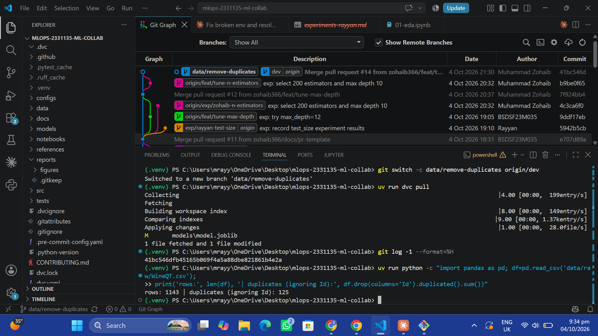
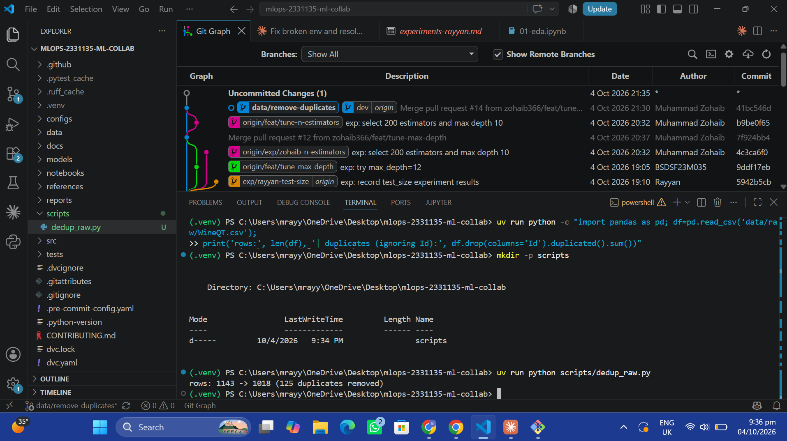
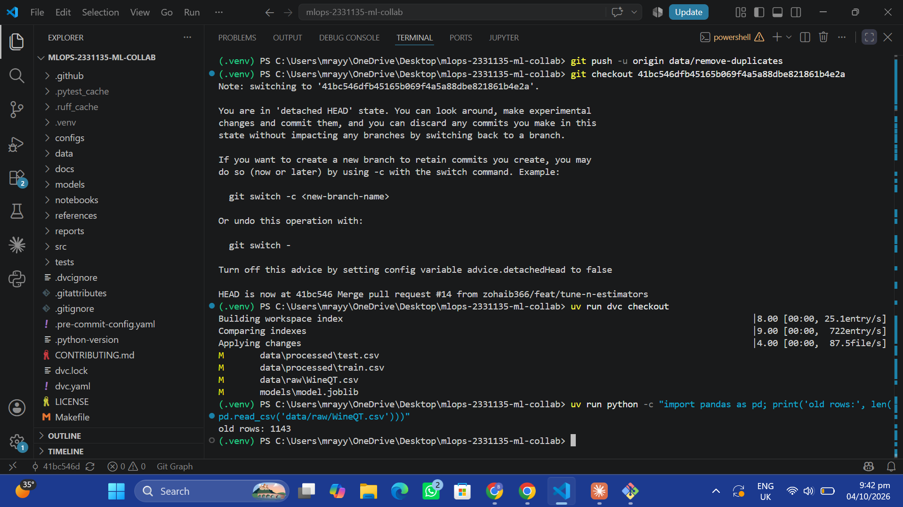
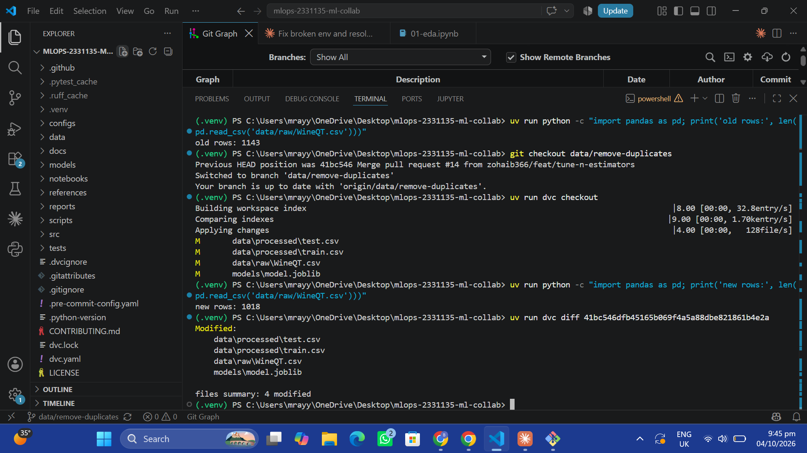
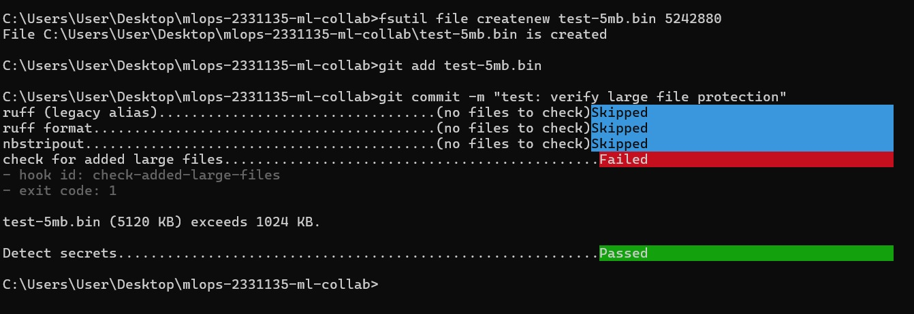
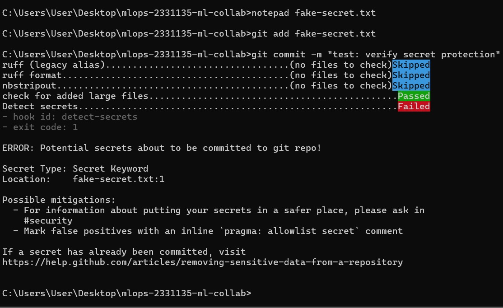

# REPORT: Git-Based Collaboration for an ML Project

Repository: https://github.com/zohaib366/mlops-2331135-ml-collab
Release: [`model-v1.0`](https://github.com/zohaib366/mlops-2331135-ml-collab/releases/tag/model-v1.0)

---

## 1. Team, roles and sources

| Member | Role | Responsibilities | Git author name |
|---|---|---|---|
| Rayyan | Data owner | DVC setup and remote, EDA, data checks, dataset updates | `Rayyan` |
| Shahid | Model owner | Training pipeline, `params.yaml`, experiments | `BSDSF23M035` |
| Zohaib | Platform owner | Repo setup, pre-commit, CI, environment, releases | `Muhammad Zohaib` |

Everyone coded and reviewed; ownership defined who led each area.

- **Dataset:** Wine Quality (red wine subset, `WineQT.csv`, 1,143 rows, 11 physicochemical features, target `quality`, plus an `Id` column). Source: TODO (Kaggle link)
- **Task:** multi-class classification of `quality`
- **Starter code:** TODO (description), source: TODO (link)
- **Project layout:** based on Cookiecutter Data Science (`configs/`, `data/`, `models/`, `notebooks/`, `references/`, `reports/`, `src/`, `tests/`)
- **DVC remote:** DagsHub. Credentials are stored per member in `.dvc/config.local`, never committed.

---

## 2. Reproducibility table (`model-v1.0`)

| Item | Value |
|---|---|
| Commit SHA (training run) | TODO (`git_sha` in final `metrics.json`) |
| `params.yaml` | `seed: 42`, `split.test_size: TODO`, `train.model: random_forest`, `train.n_estimators: TODO`, `train.max_depth: TODO` |
| Data version | `data/raw/WineQT.csv.dvc`, md5 `TODO`, 1,018 rows after deduplication |
| Environment | `uv.lock` at the release commit; Python TODO (from `.python-version`) |
| Seed | `42` (split, model initialisation, any sampling) |
| Final metrics | accuracy = TODO, f1_macro = TODO |

**How to reproduce:**
```bash
git clone https://github.com/zohaib366/mlops-2331135-ml-collab.git
cd mlops-2331135-ml-collab
git checkout model-v1.0
uv sync
dvc pull          # requires your own DagsHub credentials in .dvc/config.local
dvc repro --force
dvc metrics diff  # no changes = reproduced exactly
```

**Note on `git_sha`:** `metrics.json` records the commit the run was produced from. A file cannot contain the SHA of the commit it is saved in, so a fresh reproduction always shows a different `git_sha` line. We therefore compare reproductions with `dvc metrics diff`, which compares numeric metrics only. This rule is documented in `CONTRIBUTING.md`.

**Independent reproduction:** TODO (link to the release PR comment where Rayyan, who did not train the model, posted the matching `metrics.json`).

---

## 3. Experiments

Each member ran at least three experiments on their own `exp/` branch using `dvc exp run --set-param ...`. All experiments started from the same committed baseline with a fixed seed, so differences come from the changed parameter. Each member's `dvc exp show` table is committed on their branch in `reports/experiments-<member>.md`.

| Member | Branch | Parameter explored | Values |
|---|---|---|---|
| Shahid | `exp/shahid-max-depth` | `train.max_depth` | 4, 8, 12 |
| Zohaib | `exp/zohaib-n-estimators` | `train.n_estimators` (+ one `max_depth` run) | 50, 200, 400; 200 with depth 10 |
| Rayyan | `exp/rayyan-test-size` | `split.test_size` | 0.15, 0.25, 0.30 |

### Combined `dvc exp show` comparison

TODO: paste the three tables from `reports/experiments-shahid.md`, `reports/experiments-zohaib.md` and `reports/experiments-rayyan.md`.

### Winner and why

TODO: name the winning configuration and justify it with the metrics. We prioritise **macro-F1** over accuracy because several quality classes are rare, and accuracy mostly reflects the majority classes (5 and 6).

Winning changes were promoted by applying the experiment (`dvc exp apply`), cherry-picking it onto a `feat/` branch from `dev`, and opening a reviewed PR:
- [PR #12 · feat/tune-max-depth](https://github.com/zohaib366/mlops-2331135-ml-collab/pull/12) (Shahid)
- [PR #14 · feat/tune-n-estimators](https://github.com/zohaib366/mlops-2331135-ml-collab/pull/14) (Zohaib)

---

## 4. Key pull requests and branches

| Evidence | Link |
|---|---|
| Data-update PR (remove duplicates) | TODO: `.../pull/<n>` |
| Conflict-resolution PR | [PR #14 · feat/tune-n-estimators](https://github.com/zohaib366/mlops-2331135-ml-collab/pull/14) |
| "Changes requested" review | TODO: link to the review |
| Release PR dev → staging | [PRs into staging](https://github.com/zohaib366/mlops-2331135-ml-collab/pulls?q=is%3Apr+base%3Astaging) |
| Release PR staging → main | [PRs into main](https://github.com/zohaib366/mlops-2331135-ml-collab/pulls?q=is%3Apr+base%3Amain) |
| Abandoned experiment branch | [exp/rayyan-test-size](https://github.com/zohaib366/mlops-2331135-ml-collab/tree/exp/rayyan-test-size) |

### Conflict resolution (PR #14)

PR #12 (Shahid) and PR #14 (Zohaib) both started from the same `dev` commit and both changed the `train.max_depth` line in `params.yaml`. PR #12 was merged first. Zohaib then rebased `feat/tune-n-estimators` on the updated `dev`, which produced a conflict on that line.

- Conflicting values: `max_depth: TODO` (dev, from PR #12) vs `max_depth: 10` (this branch)
- Kept: TODO, because TODO (metric evidence from the PR description)
- `dvc.lock` and `metrics.json` were regenerated with `dvc repro` after the rebase rather than hand-merged.

### Data update: removing duplicate rows

During EDA (`notebooks/01-eda.ipynb`) we found that the `Id` column made every row look unique. Ignoring `Id`, **125 of the 1,143 rows were exact duplicates**. Duplicates can land in both the train and test splits, so the model is partly evaluated on rows it trained on, which inflates test metrics.

Rayyan removed them with a committed, reproducible script (`scripts/dedup_raw.py`, which keeps the first occurrence and ignores `Id`), re-tracked the file with `dvc add`, and re-ran the pipeline. The old version was then recovered with `git checkout` + `dvc checkout` and compared with the new one (screenshots in [Section 7.1](#71-rayyan-data-owner)).

| | Rows | Duplicates (ignoring `Id`) | accuracy | f1_macro |
|---|---|---|---|---|
| Before (`41bc546`) | 1,143 | 125 | TODO | TODO |
| After (`data/remove-duplicates`) | 1,018 | 0 | TODO | TODO |

The test set changes along with the data, so the metric shift reflects the data fix, not a model change.

### Abandoned experiment: `exp/rayyan-test-size`

This branch tried `split.test_size` = 0.15, 0.25 and 0.30 (baseline TODO). Results: accuracy TODO–TODO, macro-F1 TODO–TODO.

It was abandoned deliberately. Changing `test_size` changes which rows are in the test set, so the resulting metrics are not comparable with the baseline or with the other experiments. The observed differences were within what a different test sample alone would cause, not evidence of a better model. The split size is a reporting decision fixed in `params.yaml`, not a hyperparameter to tune for score. The branch is kept unmerged as a record.

---

## 5. Guard rails and CI

### Pre-commit hooks

`.pre-commit-config.yaml` runs ruff (lint), ruff format, nbstripout, `check-added-large-files` (1 MB limit) and detect-secrets on every commit. Screenshots of both blocks are in [Section 7.3](#73-zohaib-platform-owner):

- A 5 MB file is rejected by `check-added-large-files` (5,120 KB exceeds 1,024 KB).
- A file containing a fake secret is rejected by detect-secrets.

### CI (`.github/workflows/ci.yml`)

Runs on every PR into `dev`, `staging` and `main`: lint (`ruff check`, `ruff format --check`), unit tests (`pytest`), data checks (schema, value ranges, nulls) and a smoke train on a small committed sample. All jobs are required status checks in branch protection. Screenshots of a failing and a passing check are in [Section 7.3](#73-zohaib-platform-owner).

### Screenshot index

| Screenshot | Captured by | Location |
|---|---|---|
| Blocked large file | Zohaib | [7.3](#73-zohaib-platform-owner) |
| Blocked secret | Zohaib | [7.3](#73-zohaib-platform-owner) |
| Failing CI check | Zohaib | [7.3](#73-zohaib-platform-owner) |
| Passing CI check | Zohaib | [7.3](#73-zohaib-platform-owner) |
| Dataset before deduplication | Rayyan | [7.1](#71-rayyan-data-owner) |
| Deduplication run | Rayyan | [7.1](#71-rayyan-data-owner) |
| Old data version restored (`dvc checkout`) | Rayyan | [7.1](#71-rayyan-data-owner) |
| New data version restored + `dvc diff` | Rayyan | [7.1](#71-rayyan-data-owner) |

---

## 6. Retrospective

We held the retrospective after Phase 8 rather than after the release, so that this report and the resulting `CONTRIBUTING.md` changes could ship with `model-v1.0` instead of requiring a second promotion to `main`.

**What broke**

1. **Root `.gitignore` blocked DVC pointers.** Ignoring the whole `data/` folder also ignored `data/raw/WineQT.csv.dvc` and DVC's own `.gitignore`, so `dvc add` failed. We replaced it with patterns that ignore data files but allow `*.dvc` and `.gitignore` files through. We also learned that DVC writes its `.gitignore` next to the tracked file (`data/raw/.gitignore`), not in `data/`.
2. **Corrupted virtual environment.** A `.venv` created outside uv, combined with the repo living in a OneDrive-synced folder, led to missing package files and "Access is denied" errors. We rebuilt it with `uv sync` and stopped activating the venv manually.
3. **`git_sha` never matched on reproduction.** This is expected (see Section 2), but it initially looked like a reproducibility failure.
4. **Duplicates hidden by `Id`.** Duplicate detection found nothing until the `Id` column was excluded.
5. **Branch naming slip.** The PR template was merged from `docs/pr-template` (PR #11), which is not one of our allowed prefixes.
6. **Inconsistent Git identity.** One member's commits were authored under a student ID (`BSDSF23M035`) instead of a name, which makes contribution harder to read from the history.

**What we added to `CONTRIBUTING.md`**

- Never ignore whole data folders; use the DVC-compatible ignore patterns.
- Create environments only with `uv sync` and run tools with `uv run`; keep the repo outside cloud-synced folders.
- Compare reproductions with `dvc metrics diff`, not `git diff metrics.json`.
- Reviewers reproduce with `dvc repro --force` in a fresh clone; a plain `dvc repro` after `dvc pull` skips every stage and proves nothing.
- Always `dvc push` before `git push`.
- Documentation changes use the `feat/` prefix; only `feat/`, `data/`, `exp/` and `fix/` are allowed.
- Every member sets `git config user.name` to their real name before their first commit.

---

## 7. Individual contributions

### 7.1 Rayyan (Data owner)

I owned the data side of the project. I set up the shared DagsHub DVC remote and, on `data/initial-dataset`, initialised DVC and tracked the raw `WineQT.csv` so that only its `.dvc` pointer is in Git history. Along the way I found and fixed the root `.gitignore` rule that was hiding DVC pointer files. I wrote the EDA notebook (`notebooks/01-eda.ipynb`), paired with a jupytext script, covering the target distribution, feature distributions and skew, outliers and correlations, and moved the reusable `clean_data()` function into `src/features.py` with unit tests. The EDA revealed that the `Id` column was hiding 125 duplicate rows, which led to my `data/remove-duplicates` PR: a scripted, reproducible deduplication (1,143 → 1,018 rows), re-tracked with DVC and retrained, plus a demonstration that the old data version can be recovered with `git checkout` + `dvc checkout`. I ran three `test_size` experiments on `exp/rayyan-test-size` and deliberately abandoned that branch (see Section 4). As a reviewer I reproduced Shahid's pipeline PR on a fresh clone with `dvc pull` and `dvc repro --force`, raised the `git_sha` reproducibility issue that became a team rule, and reviewed Zohaib's conflict-resolution PR (#14). I also performed the independent reproduction for the `release: v1.0` PR.

**Dataset before deduplication: 1,143 rows, 125 duplicates when `Id` is ignored**



**Running the dedup script: 1,143 → 1,018 rows**



**Restoring the old data version: `git checkout 41bc546` + `dvc checkout` → 1,143 rows**



**Restoring the new data version: `git checkout data/remove-duplicates` + `dvc checkout` → 1,018 rows; `dvc diff` shows the raw data, processed splits and model changed**



### 7.2 Shahid (Model owner)

I owned the training pipeline. I imported the starter code into `src/` and refactored it to run from the command line with no hardcoded paths. On `feat/dvc-pipeline` I moved every hyperparameter, the split ratio and the seed into `params.yaml`, split the code into `prepare`, `train` and `evaluate` stages defined in `dvc.yaml`, set seeds for the split and model initialisation, fitted preprocessing on the training split only, and logged the commit SHA into `metrics.json` with every run. I ran three `max_depth` experiments (4, 8, 12) on `exp/shahid-max-depth`, applied the best one with `dvc exp apply`, cherry-picked it onto `feat/tune-max-depth`, and opened PR #12 with the before → after metrics and the `dvc exp show` table. That PR was merged first, which set up the planned conflict with Zohaib's PR #14. As a reviewer I reviewed and merged the PR template (PR #11), reviewed Rayyan's EDA notebook PR (requesting changes before approval), and reviewed the data-update PR by pulling the new data on a fresh clone and confirming the row count and metrics. I trained the final model and opened the `release: v1.0` PR from `dev` into `staging`.

### 7.3 Zohaib (Platform owner)

I owned the platform side. I created the repository, added the team and instructor, scaffolded the Cookiecutter-style layout, wrote the `.gitignore`, pinned the environment with uv (`pyproject.toml` + `uv.lock`), created the `staging` and `dev` branches, and turned on branch protection for all three long-lived branches. I wrote `CONTRIBUTING.md` (branch naming, Conventional Commits, squash-merge into `dev`). On `feat/pre-commit` I added ruff, nbstripout, `check-added-large-files` (1 MB) and detect-secrets, and verified that both a 5 MB file and a fake secret are blocked (screenshots below). I added the pull request template with the review checklist (PR #11). I ran four `n_estimators` experiments on `exp/zohaib-n-estimators`, including one that also changed `max_depth`, and opened PR #14. After Shahid's PR #12 merged, I rebased onto `dev`, resolved the `max_depth` conflict in `params.yaml` using metric evidence, regenerated the pipeline outputs, and documented the resolution in the PR. I reviewed and merged PR #12. I built the CI workflow (lint, tests, data checks, smoke train), demonstrated a failing check blocking a merge, made the checks required, merged the release into `main`, and tagged `model-v1.0`.

**Pre-commit blocking a 5 MB file (`check-added-large-files`)**



**Pre-commit blocking a fake secret (`detect-secrets`)**



**Failing CI check (deliberately broken test, merge blocked)**

 <!-- TODO: add screenshot -->

**Passing CI check**

 <!-- TODO: add screenshot -->
